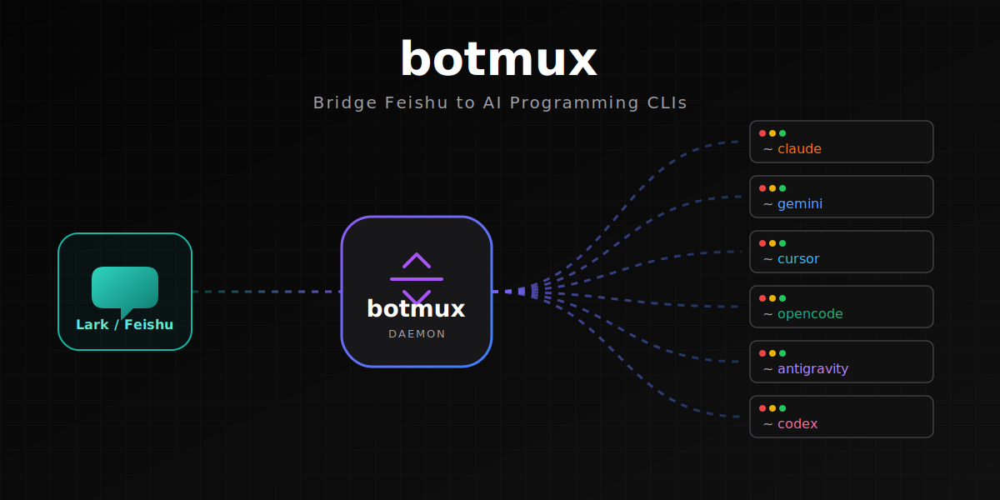
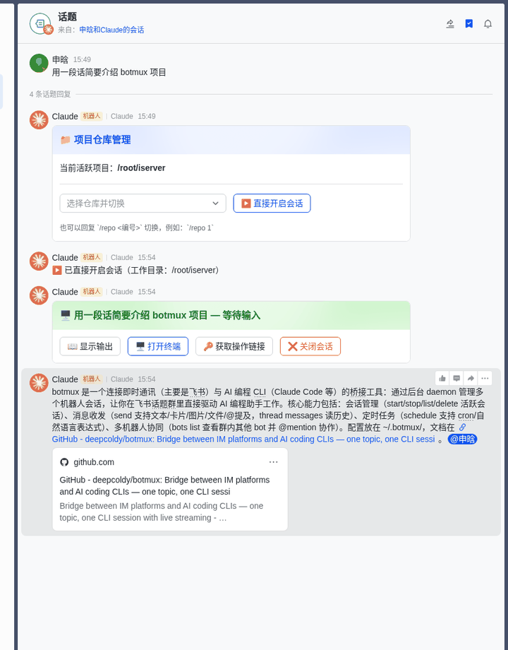
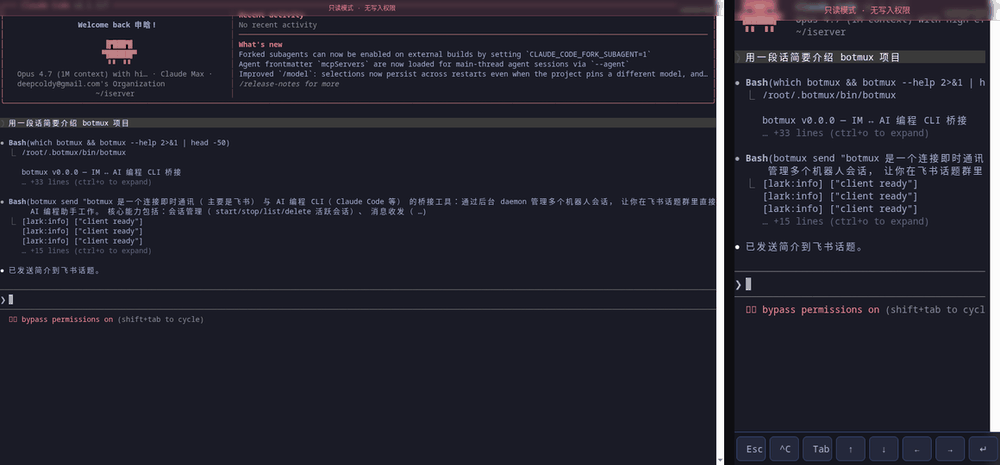
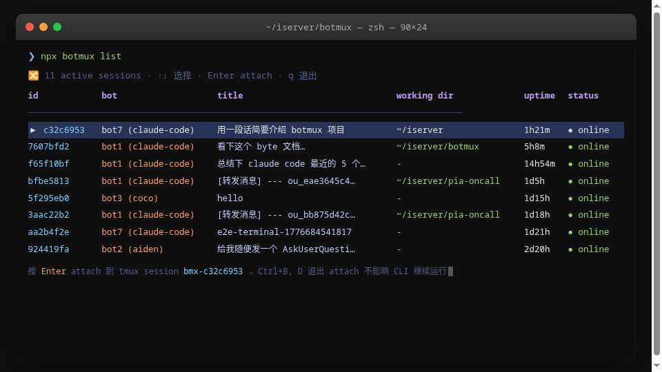
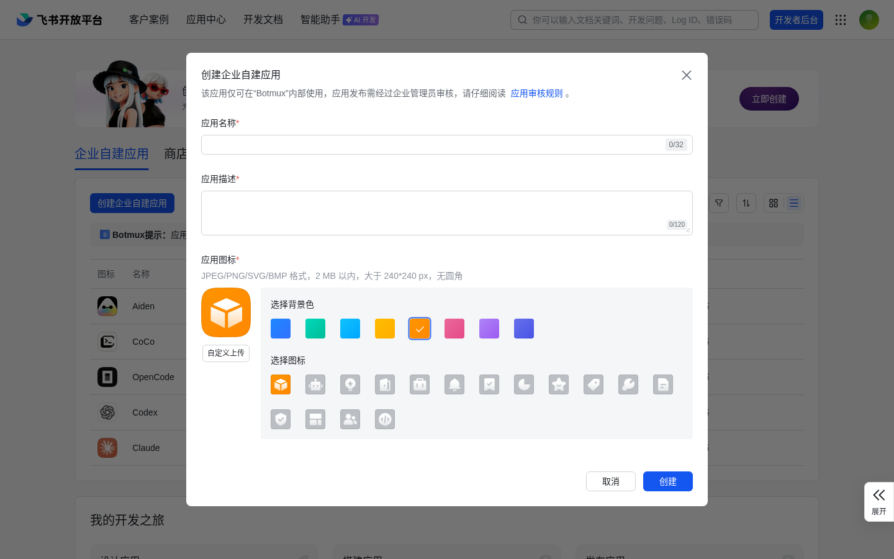
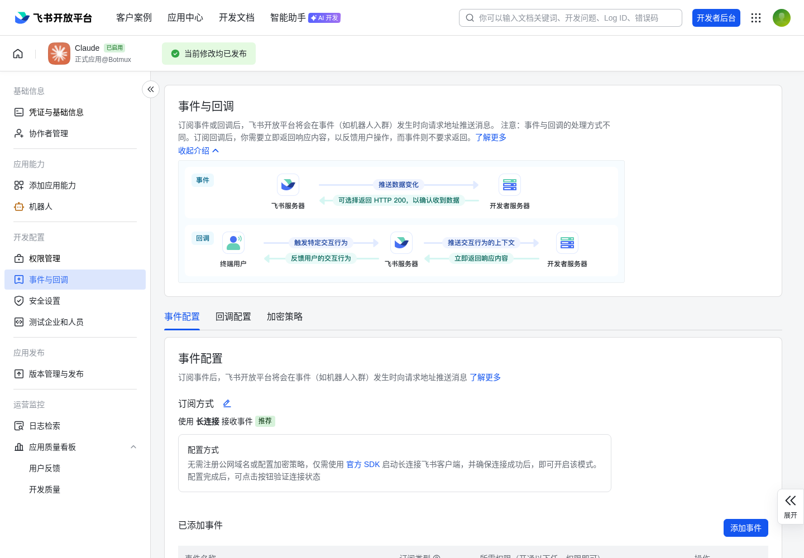
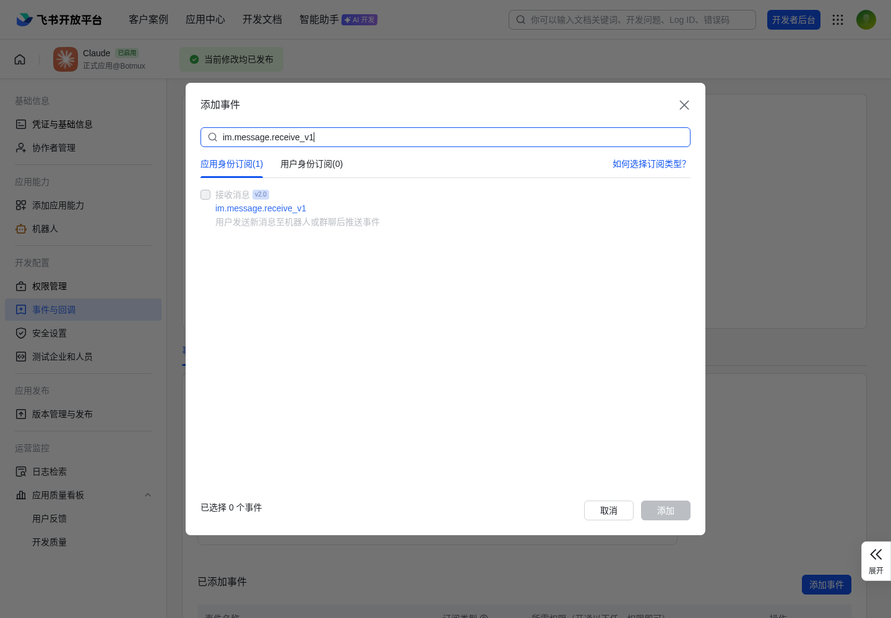

# botmux

<p align="center">
  
</p>

<p align="center">
  <a href="LICENSE"></a>
  = 20">
  <a href="https://www.npmjs.com/package/botmux"></a>
  <a href="https://github.com/deepcoldy/botmux"></a>
</p>

<p align="center">
  <a href="#设计理念">设计理念</a> · <a href="#核心优势">核心优势</a> · <a href="#5-分钟快速接入">快速接入</a> · <a href="#使用指南">使用指南</a> · <a href="#配置">配置</a>
</p>

<p align="center">
  中文 | <a href="README.en.md">English</a>
</p>

---

**飞书话题群 + AI 编程 CLI，一条消息启动编程会话。** Daemon 监听飞书消息，为每个新话题自动启动独立 CLI 进程（Claude Code / Codex / Gemini / OpenCode），提供实时流式卡片和可交互 Web 终端。

## 演示

| 飞书流式卡片 | Web 终端 | tmux 会话管理 | 多机器人协作 |
|:-:|:-:|:-:|:-:|
|  |  |  |  |

<details>
<summary>完整演示视频</summary>

[演示视频](https://github.com/user-attachments/assets/3ba4c681-0a7e-4a03-89c8-b8d26b544a65)
</details>

---

## 为什么选择 botmux

### 设计理念

**不做 SDK wrapper，直接桥接 CLI。**

botmux 不重新实现 Agent 能力，而是直接桥接已有的 AI 编程 CLI（Claude Code、Codex、Gemini、OpenCode）。记忆、上下文管理、工具调用、权限体系——这些能力 CLI 本身都在快速迭代，botmux 选择站在这个进化之上，而不是平行重造一套。CLI 的每次升级，botmux 零适配自动受益。

### 核心优势

与 OpenClaw 等基于 Agent SDK 构建的方案相比：

| 特性 | botmux | OpenClaw 类方案 |
|------|--------|----------------|
| 底层架构 | 直接桥接完整 CLI 进程 | 基于 Agent SDK 重新构建 |
| CLI 能力 | 完整运行时（hooks、memory、plan mode、MCP 生态、`/` 命令） | SDK API 子集，需手动实现缺失功能 |
| CLI 升级 | 零适配自动受益 | 需要跟进 SDK 版本变更 |
| 记忆 / 上下文 | 直接复用 CLI 内建的记忆系统，随 CLI 迭代自动增强 | 需自建记忆系统，与 CLI 原生能力重复 |
| 多 CLI 支持 | 4 种 CLI 一键切换（Claude Code / Codex / Gemini / OpenCode） | 绑定单一 SDK，无法切换 CLI |
| Web 终端 | 可交互的完整终端，移动端快捷键工具栏，手机/电脑/飞书三端同步 | 通常仅 Web 聊天界面或只读输出 |
| 多机器人协作 | 多 bot 同群 @mention 路由，独立进程隔离，不同 CLI 赛博斗蛐蛐 | 通常单机器人 |
| 终端直连 | tmux attach 直接进入 CLI 进程，和本地开发体验一致 | 无法直接操作底层终端 |
| 安装部署 | `npm install -g botmux`，5 分钟飞书配置即可使用 | 安装简单，但配置项较多 |

---

## 功能特性

### 实时流式卡片

每轮对话生成一个实时更新的飞书卡片：

- 终端输出实时渲染为 Markdown，自动过滤 TUI 装饰，仅展示实际工作输出
- 状态指示：🟡 启动中 → 🔵 工作中 → 🟢 就绪
- 操作按钮：打开终端、获取操作链接、重启 CLI、关闭会话
- 每次回复创建新的流式卡片，上一轮卡片冻结在最后状态

### Web 终端（可交互）

每个会话提供一个 Web 终端，地址为 `http://<WEB_EXTERNAL_HOST>:<端口>`。

- **只读链接** — 展示在群话题的流式卡片上，随时查看进度
- **可操作链接** — 按需获取（点击卡片上的「🔑 获取操作链接」通过私聊发送），可直接在浏览器中操作 CLI
- 移动端/平板提供悬浮快捷键工具栏（Esc、Ctrl+C、Tab、方向键等），手机上也能流畅操作

### 多机器人协作

支持在同一台机器上运行多个飞书机器人，每个机器人可对应不同的 CLI。同一群聊中的多个机器人通过 @mention 路由消息，仅有一个机器人时自动响应无需 @。

### Tmux 会话常驻

安装 tmux 后自动启用。CLI 进程常驻在 tmux session 内，所有功能不受影响。

**核心收益：Daemon 重启不中断 CLI。** `botmux restart` 时 worker 进程退出，但 tmux session（及其中的 CLI 进程）保持运行。下次收到消息时 worker 自动 re-attach，无需 `--resume` 重载上下文。

| 事件 | tmux session | CLI 进程 |
|------|-------------|---------|
| `botmux restart` | 存活 | 存活（下次消息 re-attach） |
| `/close` 或关闭按钮 | 销毁 | 终止（SIGHUP） |
| CLI 自行退出 / 崩溃 | 随之关闭 | 已退出（自动重启用新 session） |

```bash
# 推荐：交互式会话列表 — 选择后直接 attach 到 tmux
npx botmux list

# 也可以手动 attach（会话名 = bmx-<sessionId 前 8 位>）
tmux attach -t bmx-<session-id-前8位>
# Ctrl+B, D 退出 attach，不影响 CLI 继续运行

# 强制降级到纯 pty 模式（不使用 tmux）
BACKEND_TYPE=pty botmux start
```

`botmux list` 提供交互式 TUI，显示所有活跃会话的 ID、标题、工作目录、PID、运行时长和状态，方向键选择后回车即可 attach。也支持 `botmux list --plain` 输出纯文本表格供脚本使用。

**tmux 会话命名规则：** `bmx-<sessionId 前 8 位>`

### 会话接入（Adopt）

将已在 tmux 中运行的 CLI 进程无缝接入 Botmux，在手机上通过飞书查看进度和交互。

```
/adopt              # 扫描 tmux，弹出选择卡片
/adopt 0:2.0        # 直接接入指定 tmux pane
```

- **共享模式** — Botmux 接入后，iTerm2 和飞书双向同步：流式卡片实时显示终端输出，飞书聊天框输入直接透传到终端
- **一键接管** — 点击流式卡片上的「🔄 接管」按钮，Botmux 以 `--resume` 重建会话，转为标准 Botmux 会话
- **安全断开** — 点击「⏏ 断开」，Botmux 退出观察，原 CLI 不受影响

### 定时任务

支持三种调度类型 + 中文自然语言，支持原话题延续（到点在同一话题内继续，不另开 thread）。

**两种创建方式**：
- **斜杠命令**（快捷）：`/schedule 每日17:50 帮我看看AI圈有什么新闻`
- **对话触发**（灵活）：直接跟 agent 说「帮我加个每天 18:00 检查部署的定时任务」，自动触发 `botmux-schedule` Skill

支持的调度格式：
- 中文自然语言：`每日17:50` / `每周一10:00` / `30分钟后` / `明天9:00`
- 英文 duration/interval：`30m` / `2h` / `every 30m` / `every 2h`
- Cron 表达式：`0 9 * * *`
- ISO 时间戳：`2026-05-01T10:00`

### 与飞书话题的交互（Skill + CLI）

CLI 进入 botmux 会话时自动获得 `~/.botmux/bin` 在 PATH 中，以及一组开箱即用的 Skill：

- `botmux send` — 向当前话题发消息（支持文本、图片、文件、@mention）
- `botmux thread messages` — 读取当前话题的历史消息
- `botmux bots list` — 查询当前群聊的机器人及 open_id
- `botmux schedule` — 增删改查定时任务

这些能力通过 `--append-system-prompt` 注入和 Skill 描述自动引导 agent 使用，老用户熟悉的 MCP 入口已移除（旧配置会被自动清理）。

---

## 前置要求

- **Node.js** >= 20
- **AI 编程 CLI** 已安装并完成认证（`claude`、`codex`、`gemini` 或 `opencode` 在 PATH 中）
- **tmux** >= 3.x（可选，安装后自动启用会话常驻）

## 5 分钟快速接入

### Step 1: 创建飞书应用

打开 [飞书开放平台](https://open.larkoffice.com/app)，点击「创建企业自建应用」。



### Step 2: 获取凭证

进入应用详情 →「凭证与基础信息」，复制 **App ID** 和 **App Secret**。


### Step 3: 添加权限

进入「权限管理」→「批量导入/导出权限」，粘贴以下 JSON 一次性导入所有权限：


<details>
<summary>点击展开批量导入 JSON</summary>

```json
{
  "scopes": {
    "tenant": [
      "contact:user.base:readonly",
      "contact:user.id:readonly",
      "im:chat:read",
      "im:chat.members:bot_access",
      "im:chat.members:read",
      "im:message",
      "im:message:readonly",
      "im:message:send_as_bot",
      "im:message:update",
      "im:message.group_at_msg",
      "im:message.group_at_msg:readonly",
      "im:message.group_msg",
      "im:message.p2p_msg:readonly",
      "im:message.reactions:write_only",
      "im:resource"
    ]
  }
}
```
</details>

### Step 4: 安装 & 启动 botmux

```bash
# 安装
npm install -g botmux

# 交互式配置 — 输入 Step 2 的 App ID 和 App Secret
botmux setup

# 启动（飞书后台配置长连接订阅前需要先启动，否则无法检测到连接）
botmux start
```

### Step 5: 配置事件订阅

回到飞书开放平台，进入「事件与回调」：

1. **订阅方式**：点击编辑图标，选择「使用长连接接收事件」（需要 botmux 已启动，飞书会检测长连接是否建立）



2. **添加事件**：点击「添加事件」，搜索添加 `im.message.receive_v1`（接收消息 v2.0）



3. **启用回调**：切换到「回调配置」tab，开启「卡片回传交互」（`card.action.trigger`）

### Step 6: 发版

进入「版本管理与发布」，点击「创建版本」并发布。可用性范围选择「仅自己可见」即可自动通过审核。


### Step 7: 建群开聊

1. 飞书中创建一个**话题群**
2. 进入群设置 → 群机器人 → 添加刚创建的机器人
3. 在群里发消息，机器人自动响应


---

## 使用指南

### 使用流程

1. 在飞书话题群中发送消息创建新话题
2. 机器人弹出仓库选择卡片 — 选择项目或点击「直接开启会话」
3. CLI 在所选目录下启动
4. 话题中出现实时流式卡片，展示终端输出并支持 Markdown 渲染
5. 每次回复创建新的流式卡片，上一轮卡片冻结在最后状态
6. 点击卡片上的「🔑 获取操作链接」通过私聊获取可写终端链接
7. CLI 通过 `botmux send` 命令在话题中回复（由 `botmux-send` Skill 自动引导）

### 斜杠命令

| 命令 | 说明 |
|------|------|
| `/repo` | 显示项目选择卡片 |
| `/repo <N>` | 切换到上次扫描的第 N 个项目 |
| `/skip` | 跳过仓库选择，直接开启会话 |
| `/cd <路径>` | 切换工作目录 |
| `/status` | 查看会话信息（运行时间、终端地址等） |
| `/restart` | 重启 CLI 进程 |
| `/close` | 关闭会话并终止 CLI |
| `/adopt` | 接入已运行的 CLI 会话（tmux） |
| `/schedule` | 管理定时任务 |
| `/help` | 显示可用命令 |
| `/compact` `/model` `/clear` `/plugin` `/usage` | 字面透传给底层 CLI（例如 Claude Code 的内置 slash 命令） |

### 定时任务管理

**推荐方式：跟 agent 对话**
直接说「每天 9:00 帮我生成昨天 PR 汇总」，agent 会用 `botmux-schedule` Skill 处理并跟你确认。

**斜杠命令方式（快捷）**

```
# 中文自然语言
/schedule 每日17:50 帮我看看AI圈有什么新闻
/schedule 工作日每天9:00 检查服务状态
/schedule 每周一10:00 生成周报

# 一次性任务
/schedule 30分钟后 检查部署状态
/schedule 明天9:00 发早会提醒

# 英文语法
/schedule every 2h 巡检服务
/schedule 30m 提醒我喝水

# 标准 cron
/schedule 0 9 * * * 早安问候
```

管理任务：

```
/schedule list
/schedule remove <id>
/schedule enable <id>
/schedule disable <id>
/schedule run <id>
```

**任务执行行为**：到点会在**创建任务的原话题**内续一条消息并执行，不会另开 thread。工作目录与创建时一致。如果原话题的会话还活着，prompt 直接注入现有会话（不另起 worker）。

---

## CLI 命令

| 命令 | 说明 |
|------|------|
| `botmux setup` | 交互式配置（首次使用 / 添加机器人） |
| `botmux start` | 启动 daemon（PM2 管理） |
| `botmux stop` | 停止 daemon |
| `botmux restart` | 重启 daemon（自动恢复活跃会话） |
| `botmux logs` | 查看日志（`--lines N`） |
| `botmux status` | 查看 daemon 状态 |
| `botmux upgrade` | 升级到最新版本 |
| `botmux list` | 列出所有活跃会话（别名 `ls`） |
| `botmux delete <id>` | 关闭指定会话，支持 ID 前缀匹配（别名 `del`/`rm`） |
| `botmux delete all` | 关闭所有活跃会话 |
| `botmux delete stopped` | 清理所有进程已退出的僵尸会话 |

### 会话内子命令（给 CLI agent 用）

会话内的 agent 可以直接调用这些命令，session 信息通过祖先进程标记自动推断：

| 命令 | 说明 |
|------|------|
| `botmux send [content]` | 向当前话题发消息。支持 stdin / heredoc / `--content-file` 传内容，`--images`/`--files`/`--mention` 附加资源 |
| `botmux bots list` | 列出当前群聊中的机器人（含 open_id，供 `--mention` 使用） |
| `botmux thread messages [--limit N]` | 拉取当前话题的消息历史（JSON） |
| `botmux schedule add <schedule> <prompt>` | 创建定时任务（自动绑定当前话题） |
| `botmux schedule list/remove/pause/resume/run` | 管理定时任务 |

这些命令依赖 `~/.botmux/bin/botmux` 这个 wrapper 脚本，daemon 启动时自动写入并加入 worker 的 PATH，版本始终与 daemon 一致（不需要 `npm i -g`）。

---

## 配置

通过 `~/.botmux/bots.json` 配置机器人。运行 `botmux setup` 交互式创建，或手动编辑。

```bash
# 交互式配置
botmux setup
```

**bots.json 格式：**

```json
[
  {
    "larkAppId": "cli_xxx_bot1",
    "larkAppSecret": "secret_1",
    "cliId": "claude-code",
    "workingDir": "~/projects",
    "allowedUsers": ["alice@company.com"]
  },
  {
    "larkAppId": "cli_xxx_bot2",
    "larkAppSecret": "secret_2",
    "cliId": "codex",
    "workingDir": "~/work"
  }
]
```

| 字段 | 必填 | 说明 |
|------|------|------|
| `larkAppId` | 是 | 飞书应用 App ID |
| `larkAppSecret` | 是 | 飞书应用 App Secret |
| `cliId` | 否 | CLI 适配器，默认 `claude-code`（可选：`aiden`、`coco`、`codex`、`gemini`、`opencode`） |
| `cliPathOverride` | 否 | CLI 可执行文件路径覆盖 |
| `backendType` | 否 | 会话后端：`pty` 或 `tmux`（默认自动检测） |
| `workingDir` | 否 | 默认工作目录，支持逗号分隔多个目录 |
| `allowedUsers` | 否 | 允许的用户列表（邮箱前缀或 open_id） |
| `projectScanDir` | 否 | 扫描 Git 仓库的目录 |

**配置优先级：** `BOTS_CONFIG` 环境变量 → `~/.botmux/bots.json`

### 环境变量

| 变量 | 默认值 | 说明 |
|------|--------|------|
| `BOTS_CONFIG` | _(未设置)_ | 指定 bots.json 路径（覆盖默认位置） |
| `WEB_HOST` | `0.0.0.0` | HTTP 服务绑定地址 |
| `WEB_EXTERNAL_HOST` | _(自动检测局域网 IP)_ | 终端链接中的外部主机名/IP |
| `SESSION_DATA_DIR` | `~/.botmux/data` | 会话和队列的存储目录 |
| `DEBUG` | _(未设置)_ | 设为 `1` 启用调试日志 |

### 文件位置

| 路径 | 说明 |
|------|------|
| `~/.botmux/bots.json` | 机器人配置文件 |
| `~/.botmux/data/` | 会话数据、消息队列 |
| `~/.botmux/logs/` | Daemon 日志 |

---

## 贡献

参见 [CONTRIBUTING.md](CONTRIBUTING.md)。

## 许可证

[MIT](LICENSE)
